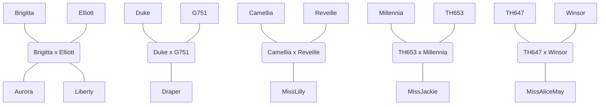

# ブルーベリー品種家系図(Highbush)

```mermaid
graph TD;

Aurora["Aurora"]
Brigitta["Brigitta"]
Draper["Draper"]
Duke["Duke"]
Elliott["Elliott"]
Camellia["Camellia"]
G751["G751"]
Liberty["Liberty"]
Millennia["Millennia"]
MissAliceMay["MissAliceMay"]
MissJackie["MissJackie"]
MissLilly["MissLilly"]
Reveille["Reveille"]
TH647["TH647"]
TH653["TH653"]
Winsor["Winsor"]

BrigittaxElliott("Brigitta x Elliott")
CamelliaxReveille("Camellia x Reveille")
DukexG751("Duke x G751")
TH653xMillennia("TH653 x Millennia")
TH647xWinsor("TH647 x Winsor")

Brigitta --- BrigittaxElliott
Duke --- DukexG751
Elliott --- BrigittaxElliott
G751 --- DukexG751
Camellia --- CamelliaxReveille
Millennia --- TH653xMillennia
Reveille --- CamelliaxReveille
TH647 --- TH647xWinsor
TH653 --- TH653xMillennia
Winsor ---TH647xWinsor

BrigittaxElliott --- Aurora
BrigittaxElliott --- Liberty
CamelliaxReveille --- MissLilly
DukexG751 --- Draper
TH647xWinsor --- MissAliceMay
TH653xMillennia --- MissJackie

```